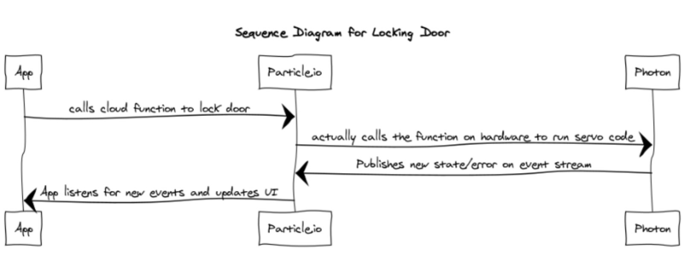

# Developer Documentation

## Setup
### Hardware Setup
The wiring for each of the devices are as follows:
* Temperature Sensor => Photon (Left to right when flat side of the sensor facing you):
  * Left Pin: Pin 1 (GND) ⇒ GND
  * Middle Pin: Pin 2 (DQ) ⇒ D4
  * Right Pin: Pin 3 (VDD) ⇒ 3V3
  * Between Pin 2 and 3 put a 4.7k (or 10k) resistor on the sensor.

* Piezo Buzzer => Photon
  * Pin below the positive symbol => D7
  * Other Pin => GND

* PIR Motion Sensor => Photon (Sensor pins are labelled on the sensor)
  * GND => GND
  * OUT => D0
  * +5V => VIN

* Servo => Photon (Pins not visible, servo wire color used instead)
  * Brown (GND) => GND
  * Red (Middle wire, Power) => VIN
  * Orange (OUT) => D3

* Button1 (Light Power Button) => Photon
  * Any one pin => D1
  * Diagonally opposite pin => GND
  * Other pins should not be connected to each other

* Button1 (Stay/Away Mode Button) => Photon  
  * Any one pin => D2
  * Diagonally opposite pin => GND
  * Other pins should not be connected to each other

* LED => Photon
  * Cathode => GND
  * Anode => D5
  * Put a resistor between the Anode => D5 connection

* Battery Pack => Photon
  * Cathode => GND
  * Anode => VIN

### Cloud Setup
* Following webhooks should be present and created for notifications settings:
  * Door Stopped Webhook
    * Event Name: door_stopped
    * URL: https://hooks.slack.com/services/{{{slackURL}}}
    * Request Type: POST
    * Request Format: JSON
    * Device: Any

  * Door Moved Webhook
    * Event Name: door_moved
    * URL: https://hooks.slack.com/services/{{{slackURL}}}
    * Request Type: POST
    * Request Format: JSON
    * Device: Any

#### Additional Cloud Info
* The photon code sets up the following cloud functions on compiling (all functions return 0 by default, arguments are of type string):
  * publishState
    * Args: None
    * Use: publishes current device settings and sensor data to the particle event stream
  * switchOnDevice
    * Args: "true"/"false" (true: switches LED on, false: switches LED off)
    * Use: switch LED on/off
  * enableStayMode
    * Args: "true"/"false" (true: stay mode, false: away mode)
    * Use: switch stay/away mode
  * lockDoorIfEnabled
    * Args: "true"/"false" (true: locks door, false: unlocks door)
    * Use: lock/unlock door (servo)
  * enableLock
    * Args: "s"/"a" + "true"/"false" (s: stay mode, a: away mode; true/false: enables/disables locking mechanism)
    * Use: enable/disable lock (servo)
  * enableAlarm
    * Args: "s"/"a" + "true"/"false" (s: stay mode, a: away mode; true/false: enables/disables alarm on door moving after door is stopped)
    * Use: enable/disable alarm (buzzer)
  * enableCamera (not implemented in backend, was proposed bonus part)
    * Args: "s"/"a" + "true"/"false" (s: stay mode, a: away mode; true/false: enables/disables camera on door moving after door is stopped)
    * Use: enable/disable camera
  * enableNotifications
    * Args: "s"/"a" + "true"/"false" (s: stay mode, a: away mode; true/false: enables/disables slack notifications on door moving after door is stopped)
    * Use: enable/disable slack notifications
  * changeOverallModeTo
    * Args: "true"/"false" (true/false: door/fridge mode)
    * Use: switch between door and fridge mode
  * changeSlackHook
    * Args: String of the form "https://hooks.slack.com/services/..."
    * Use: Edit the slack channel where notifications are sent

### Software Setup
* In ui/js/AlarmModel.js, set the variables "myParticleAccessToken" and "myDeviceId" to match the values for your photon.
* You can get your device ID from the [particle cloud console](https://console.particle.io/).
* You can get your personal access token (for development/testing) from the [Particle Web IDE](https://build.particle.io/). The token is on the settings tab.
* Additionally, to setup a default slack channel to receive notifications, set the "slackURL" variable in AlarmController/lib/AlarmHardware/src/AlarmController.cpp, currently on line 25. The variable should be set to the part that comes after "https://hooks.slack.com/services/" in a Slack Webhook URL. You can also just use the "editSlackURL" cloud function to setup the slack endpoint. Refer to the "editSlackURL" function definition in AlarmController.cpp for a better understanding of the "slackURL" variable.

## Photon Code Settings
* The photon code uses two external libraries present in /AlarmController/lib: OneWire and SparkDallasTemperature for the temperature sensor.
* A custom library containing all the hardware-related functions is present in /AlarmController/lib called AlarmHardware.
  * Refer to the header file for function declarations.
  * To make navigation easier, the code in both .h and .cpp files is divided into these sections: SETTERS, TEMPERATURE STUFF, PIR SENSOR STUFF, BUTTON STUFF, BUZZER STUFF, SERVO STUFF. Search for the specific terms to go to the respective sections.
* The main .ino file is present in /AlarmController/src. It contains the declaration for all cloud functions along with delta timing and timers for measuring data from sensors and publishing state changes to the particle cloud event stream.

## Event Sequences
Some of the major event sequences are summarized in the sequence diagrams below.

*Sequence Diagram for Changing Settings*

*Sequence Diagram for Locking Door Settings*

*Sequence Diagram for Motion Detection (with notifications)*

*Detailed Sequence Diagram for Event Change*
